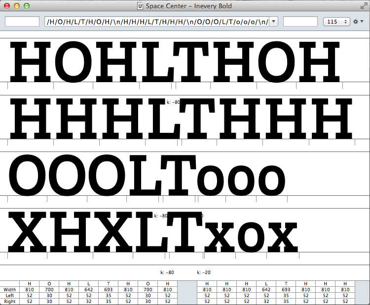

# SpaceCenterKern 1.0a

This script allows to visually check all the existing kerning pairs in the CurrentFont within a context in a new SpaceCenter window using a multiline text view.
You can also modify the kerning from the SpaceCenter itself.



---

## How it works

When the extension is launched a string with this format is created for each existing kerning pair in the current font (compressing kerning groups):

```
HOH(left)(right)HOH
HHH(left)(right)HHH
OOO(left)(right)OOO
OXO(left)(right)oxo
```

You can walk through the list with arrow keys:

- down : next pair
- up : previous pair

You can modify kerning (using the same shortcuts and values as in Tal Leming's [MetricsMachine](http://tools.typesupply.com/metricsmachine.html)):

- left : -5
- right : +5
- alt-left : -1
- alt-right : +1
- shift-left : -10
- shift-right : +10

## Note

For real kerning use [MetricsMachine](http://tools.typesupply.com/metricsmachine.html), *the* kerning tool.

Original idea from [Eduardo Manso](http://emtype.net).


## ToDo?

- Allow custom strings for kern check.
- Select glyphs in the font window and show **only** the kerning pairs with these glyphs

---
Joancarles Casasin, 2014 [write me](mailto:joanca@casasin.com) for improvements, comments, complains…

